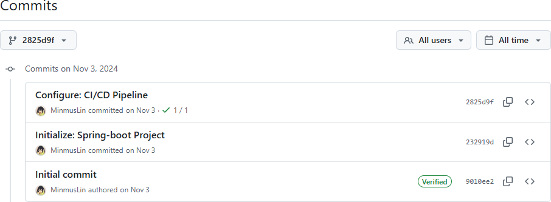
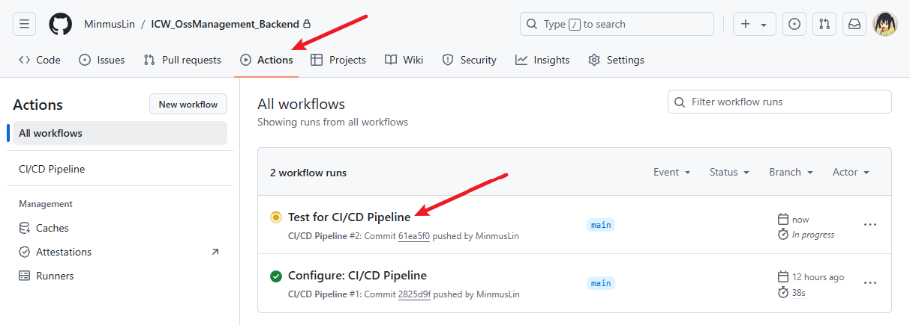
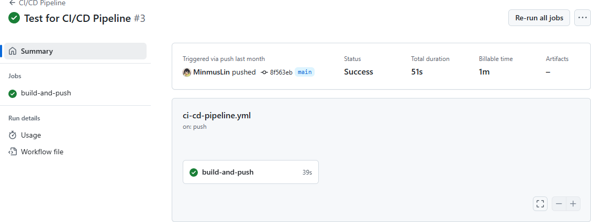
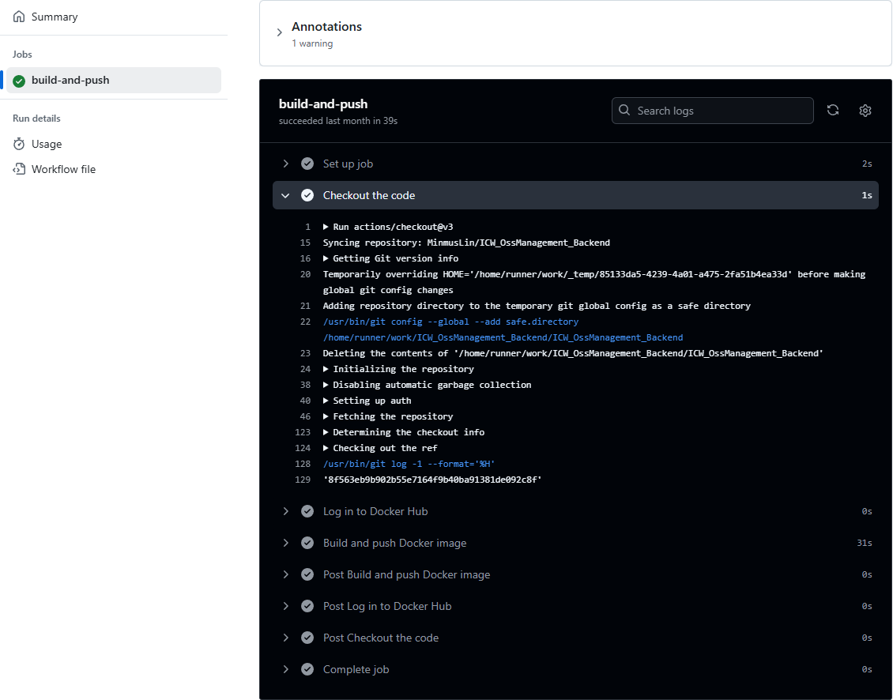
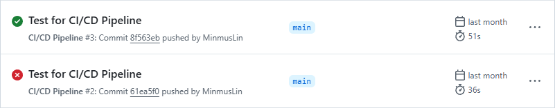
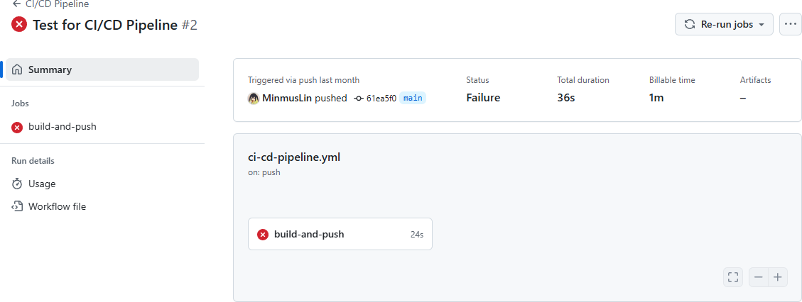
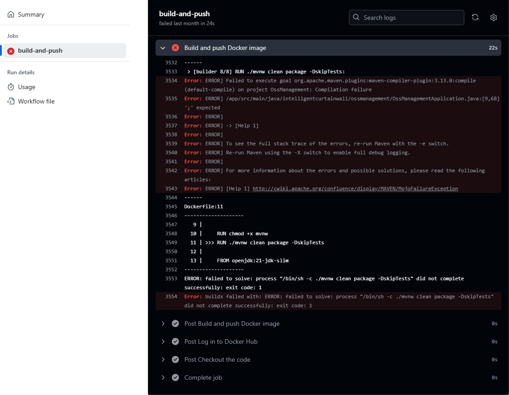

# CI/CD 工作流文档

## 版本控制

在每个子系统仓库中，开发团队需要采用良好的版本控制实践，确保代码的规范性和可追溯性。开发人员在完成某项功能开发后，将其代码合并至子系统的主分支（`main`），并遵循以下规范：

* **代码提交规范**：每次提交时必须附带清晰的提交信息，描述本次修改的内容和目的。
* **分支管理**：开发人员应创建独立的功能分支（如 `feature/xxx`）进行开发，完成开发后，通过 Pull Request（PR）将代码合并到主分支。合并前确保代码通过相关的代码审查。



## 触发 CI/CD 工作流

每次子系统主分支（`main`）发生变更时，CI/CD Pipeline 将会自动触发，启动编译、测试和部署过程。系统基于以下触发条件：

* **代码提交**：当有新的代码提交到主分支时，CI/CD Pipeline 自动启动。
* **Pull Request 合并**：当一个 Pull Request 被合并到主分支时，CI/CD Pipeline 自动启动。



## 编译与部署

在 CI/CD Pipeline 中，编译和部署流程基于预先定义好的 Dockerfile。Dockerfile 是用于构建应用镜像的文件，确保应用能够在一致的环境中进行部署。CI/CD 系统会执行以下步骤：

* **构建 Docker 镜像**：通过 Dockerfile 定义的规则构建应用镜像。
* **部署**：将构建完成的镜像推送到指定的镜像仓库（Docker Hub），然后定时部署到目标环境。

一个示例 Dockerfile 文件：

```dockerfile
FROM openjdk:21-jdk-slim AS builder

WORKDIR /app

COPY pom.xml ./
COPY src ./src
COPY mvnw .
COPY .mvn .mvn

RUN chmod +x mvnw
RUN ./mvnw clean package -DskipTests

FROM openjdk:21-jdk-slim

WORKDIR /app

COPY --from=builder /app/target/ModelingCommunication-1.0.0.jar app.jar

EXPOSE 8080

ENTRYPOINT ["java", "-jar", "/app/app.jar"]
```

开发人员可以在 GitHub Actions 中实时查看编译的进度。系统会展示以下信息：

* **构建日志**：每次构建过程中的详细日志，包括编译、测试、打包等各个步骤。
* **编译状态**：展示编译过程是否顺利，以及编译状态。





在 CI/CD Pipeline 的执行完成后，系统会显示编译的结果：

* **成功**：如果编译过程成功完成，系统会显示成功消息，并告知开发人员编译已成功。
* **失败**：如果编译过程中发生错误，系统会显示详细的错误信息，开发人员需要根据这些信息进行修复和优化。







## 反馈与迭代

每次部署到生产环境后，开发团队应收集用户和系统的反馈，进行必要的修改和优化。反馈主要来自以下途径：

* **用户反馈**：通过线上监控工具、日志分析以及用户报告等方式收集系统运行的表现和用户体验。
* **自动化监控**：使用自动化监控工具（如 Prometheus、Grafana 等）检测系统性能和稳定性，如响应时间、内存使用率等。

在收集到反馈后，开发人员需要：

1. 分析反馈内容，定位问题或优化点。
2. 进行代码修改并在本地测试。
3. 根据需要更新相应的 Dockerfile、配置文件或代码。
4. 重新提交并触发 CI/CD Pipeline，完成新一轮的部署和验证。
