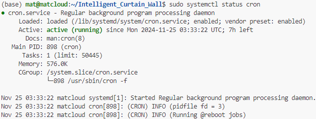

# 矩池云 GPU 环境配置文档

> [!TIP]
> 服务器环境已保存为 ICW-Environment

## 租用配置与硬件信息


## 配置 Anaconda

在用户目录下载并安装 Anaconda：

```bash
cd ~
wget https://repo.anaconda.com/archive/Anaconda3-2024.10-1-Linux-x86_64.sh
chmod +x Anaconda3-2024.10-1-Linux-x86_64.sh
./Anaconda3-2024.10-1-Linux-x86_64.sh
rm Anaconda3-2024.10-1-Linux-x86_64.sh
```

验证安装成功：

```bash
conda --version
```


配置 Anaconda 使用清华镜像源：

```bash
conda config --add channels https://mirrors.tuna.tsinghua.edu.cn/anaconda/pkgs/main/
conda config --add channels https://mirrors.tuna.tsinghua.edu.cn/anaconda/pkgs/r/
conda config --add channels https://mirrors.tuna.tsinghua.edu.cn/anaconda/pkgs/msys2/
conda config --set show_channel_urls yes
```

配置 pip 使用清华镜像源：

```bash
cd ~
mkdir .pip
cd .pip/
touch pip.conf
vim pip.conf
```

将 `pip.conf` 的内容修改为：

```
[global]
index-url = https://pypi.tuna.tsinghua.edu.cn/simple
```

输入 `:wq` 保存。

## 配置 Docker Compose

更新系统软件包列表并安装 Docker Compose：

```bash
sudo apt update
sudo apt install docker-compose
```

验证安装成功：

```bash
docker --version
docker-compose --version
```


## 配置 Trojan

更新系统软件包列表并安装 Trojan：

```bash
sudo apt update
sudo apt install trojan
```

验证安装成功：

```bash
trojan --version
```


编辑 Trojan 配置文件：

```bash
sudo nano /etc/trojan/config.json
```

```json
{
    "run_type": "client",
    "local_addr": "127.0.0.1",
    "local_port": 1080,
    "remote_addr": "139.159.217.107",
    "remote_port": 4038,
    "password": [
        "4806276b-11a2-38da-9a2c-bc6524ab0cb6"
    ],
    "log_level": 1,
    "ssl": {
        "sni": "baidu.com",
        "verify": false,
        "cipher": "ECDHE-ECDSA-AES128-GCM-SHA256:ECDHE-RSA-AES128-GCM-SHA256:ECDHE-ECDSA-AES256-GCM-SHA384:ECDHE-RSA-AES256-GCM-SHA384:ECDHE-ECDSA-CHACHA20-POLY1305:ECDHE-RSA-CHACHA20-POLY1305:DHE-RSA-AES128-GCM-SHA256:DHE-RSA-AES256-GCM-SHA384",
        "cipher_tls13": "TLS_AES_128_GCM_SHA256:TLS_CHACHA20_POLY1305_SHA256:TLS_AES_256_GCM_SHA384",
        "prefer_server_cipher": true,
        "alpn": [
            "http/1.1"
        ],
        "reuse_session": true,
        "session_ticket": false,
        "session_timeout": 600
    },
    "tcp": {
        "prefer_ipv4": false,
        "no_delay": true,
        "keep_alive": true,
        "reuse_port": false,
        "fast_open": false,
        "fast_open_qlen": 20
    }
}
```

启动 Trojan 服务：

```bash
sudo systemctl start trojan
sudo systemctl enable trojan
```

查看 Trojan 服务端口占用情况：

```bash
sudo netstat -tulpn | grep 1080
```


## 配置 Docker 代理

编辑 Docker 代理配置文件：

```bash
sudo mkdir -p /etc/systemd/system/docker.service.d
sudo nano /etc/systemd/system/docker.service.d/http-proxy.conf
```

```
[Service]
Environment="HTTP_PROXY=socks5://127.0.0.1:1080"
Environment="HTTPS_PROXY=socks5://127.0.0.1:1080"
Environment="NO_PROXY=localhost,127.0.0.1"
```

重启 Docker 服务：

```bash
sudo systemctl daemon-reload
sudo systemctl restart docker
```

查看 Docker 环境变量：

```bash
sudo systemctl show --property=Environment docker
```


## 配置 NVIDIA Docker 支持

编辑 Docker Daemon 配置文件：

```bash
sudo nano /etc/docker/daemon.json
```

```json
{
    "runtimes": {
        "nvidia": {
            "path": "nvidia-container-runtime",
            "runtimeArgs": []
        }
    }
}
```

重启 Docker 服务：

```bash
sudo systemctl daemon-reload
sudo systemctl restart docker
```

检查 NVIDIA 运行时是否配置成功：

```bash
sudo docker info | grep Runtimes
```


## 配置 Docker Compose 定时部署任务

编辑 `docker-compose.yml` 文件：

```bash
sudo nano /home/mat/Intelligent_Curtain_Wall/docker-compose.yml
```

```yml
services:
  # 金属幕墙锈蚀污损检测系统
  corrosion-detection:
    image: minmuslin/intelligent-curtain-wall:corrosion-detection
    container_name: corrosion-detection
    ports:
      - "8000:8080"
    runtime: nvidia
    environment:
      - NVIDIA_VISIBLE_DEVICES=all

  # 石材幕墙裂缝检测系统
  crack-detection:
    image: minmuslin/intelligent-curtain-wall:crack-detection
    container_name: crack-detection
    ports:
      - "8001:8080"
    runtime: nvidia
    environment:
      - NVIDIA_VISIBLE_DEVICES=all

  # 玻璃幕墙平整度检测系统
  flatness-detection:
    image: minmuslin/intelligent-curtain-wall:flatness-detection
    container_name: flatness-detection
    ports:
      - "8002:8080"
    runtime: nvidia
    environment:
      - NVIDIA_VISIBLE_DEVICES=all

  # 移动端幕墙数据采集与展示系统
  mobile-data:
    image: minmuslin/intelligent-curtain-wall:mobile-data
    container_name: mobile-data
    ports:
      - "8003:8080"
    runtime: nvidia
    environment:
      - NVIDIA_VISIBLE_DEVICES=all

  # 无人机采集数据的 3D 建模与通讯系统
  modeling-communication:
    image: minmuslin/intelligent-curtain-wall:modeling-communication
    container_name: modeling-communication
    ports:
      - "8004:8080"
    runtime: nvidia
    environment:
      - NVIDIA_VISIBLE_DEVICES=all

  # 幕墙韧性评估软件系统
  resilience-assessment:
    image: minmuslin/intelligent-curtain-wall:resilience-assessment
    container_name: resilience-assessment
    ports:
      - "8005:8080"
    runtime: nvidia
    environment:
      - NVIDIA_VISIBLE_DEVICES=all

  # 玻璃幕墙爆裂和平整度检测系统
  spalling-detection:
    image: minmuslin/intelligent-curtain-wall:spalling-detection
    container_name: spalling-detection
    ports:
      - "8006:8080"
    runtime: nvidia
    environment:
      - NVIDIA_VISIBLE_DEVICES=all

  # 石材幕墙污渍检测系统
  stain-detection:
    image: minmuslin/intelligent-curtain-wall:stain-detection
    container_name: stain-detection
    ports:
      - "8007:8080"
    runtime: nvidia
    environment:
      - NVIDIA_VISIBLE_DEVICES=all

  # 用户鉴权系统
  user-authentication:
    image: minmuslin/intelligent-curtain-wall:user-authentication
    container_name: user-authentication
    ports:
      - "8008:8080"
    runtime: nvidia
    environment:
      - NVIDIA_VISIBLE_DEVICES=all

  # 幕墙震动数据检测与展示系统
  vibration-detection:
    image: minmuslin/intelligent-curtain-wall:vibration-detection
    container_name: vibration-detection
    ports:
      - "8009:8080"
    runtime: nvidia
    environment:
      - NVIDIA_VISIBLE_DEVICES=all
```

编辑 `automated-deployment.sh` 文件：

```bash
sudo nano /home/mat/Intelligent_Curtain_Wall/automated-deployment.sh
```

```shell
#!/bin/bash

LOG_DIR="/home/mat/Intelligent_Curtain_Wall/deployment-logs"

export TZ="Asia/Shanghai"

TIMESTAMP=$(date +"%Y%m%d-%H:%M")
START_TIME=$(date +"%Y-%m-%d %H:%M:%S")
START_SECONDS=$(date +%s)
DATE_DIR=$(date +"%Y-%m-%d")

mkdir -p "$LOG_DIR/$DATE_DIR"

{
    echo "Execution Start Time: $START_TIME"

    cd /home/mat/Intelligent_Curtain_Wall

    sudo docker images -q --filter "dangling=true" | xargs sudo docker rmi

    sudo docker compose pull
    sudo docker compose down
    sudo docker compose up -d

    END_TIME=$(date +"%Y-%m-%d %H:%M:%S")
    END_SECONDS=$(date +%s)
    ELAPSED_TIME=$((END_SECONDS - START_SECONDS))

    echo "Execution End Time: $END_TIME"
    echo "Total Execution Time: $ELAPSED_TIME seconds"
} &> "$LOG_DIR/$DATE_DIR/$TIMESTAMP.txt"
```

配置 Docker Compose 定时部署任务：

```bash
sudo crontab -e
```

在最后一行添加如下配置：

```
*/30 * * * * /home/mat/Intelligent_Curtain_Wall/automated-deployment.sh
```

查看 Cron 定时服务状态：

```
sudo systemctl status cron
```



## 配置 `mat` 用户权限

允许 `mat` 用户执行所有命令，且不需要输入密码：

```bash
sudo visudo
```

在最后一行添加如下配置：

```
mat ALL=(ALL) NOPASSWD: ALL
```

## 配置子系统文件夹

配置子系统文件夹：

```bash
mkdir /home/mat/Intelligent_Curtain_Wall/corrosion-detection
mkdir /home/mat/Intelligent_Curtain_Wall/crack-detection
mkdir /home/mat/Intelligent_Curtain_Wall/flatness-detection
mkdir /home/mat/Intelligent_Curtain_Wall/mobile-data
mkdir /home/mat/Intelligent_Curtain_Wall/modeling-communication
mkdir /home/mat/Intelligent_Curtain_Wall/resilience-assessment
mkdir /home/mat/Intelligent_Curtain_Wall/spalling-detection
mkdir /home/mat/Intelligent_Curtain_Wall/stain-detection
mkdir /home/mat/Intelligent_Curtain_Wall/vibration-detection
```

配置子系统文件夹读写权限：

```bash
sudo chmod -R u+rw /home/mat/Intelligent_Curtain_Wall/
```