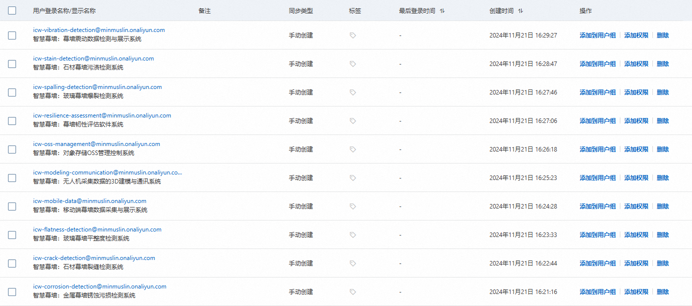
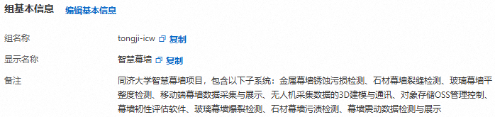
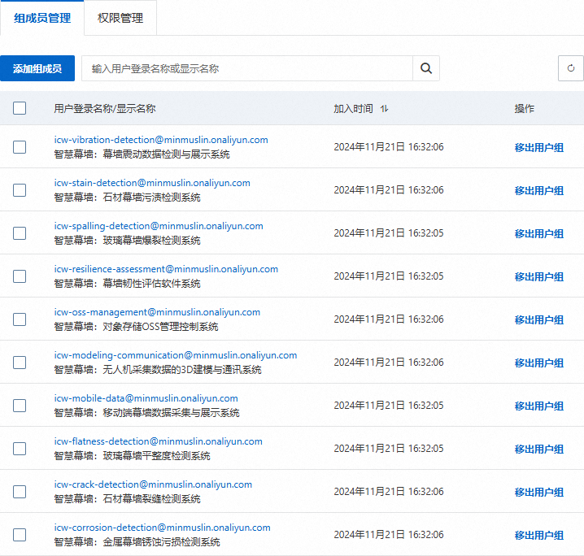
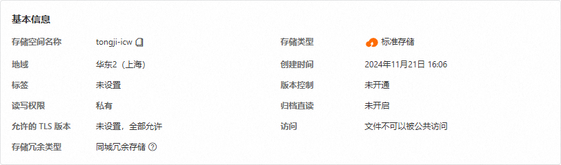
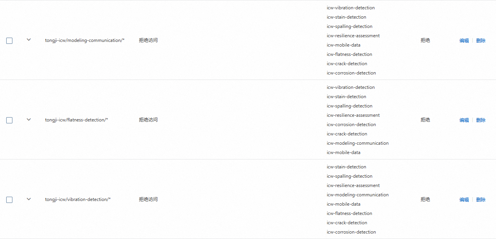
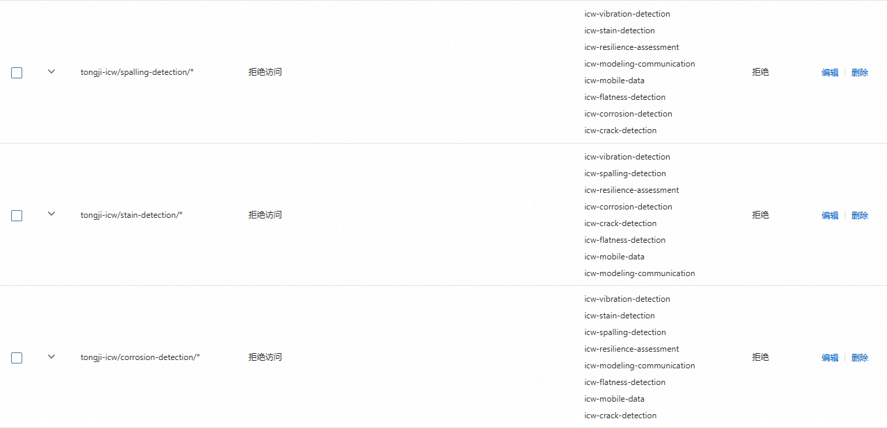
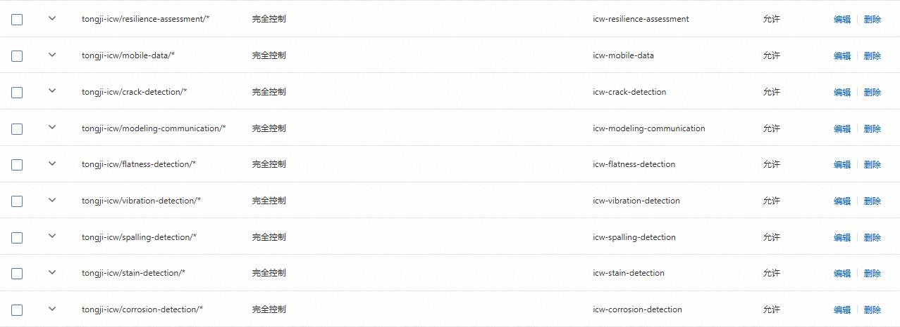

# 阿里云对象存储 OSS 配置文档

## 配置 RAM 访问控制

### 管理用户身份

创建子系统用户，选择“使用永久 AccessKey 访问”：



### 管理用户组身份

创建 tongji-icw 用户组：



进行组成员管理：



进行权限管理：


## 配置 Bucket

### 创建 Bucket

Bucket 基本信息：



### 配置子系统目录

文件列表：


### 配置权限控制

阻止公共访问：开启

Bucket ACL：私有

Bucket 授权策略（按图形策略添加）：








Bucket 授权策略（按语法策略添加）：

<details>
<summary>点击展开 / 收起配置</summary>

```
{
	"Version": "1",
	"Statement": [{
		"Effect": "Allow",
		"Action": [
			"oss:*"
		],
		"Principal": [
			"203238532177578488"
		],
		"Resource": [
			"acs:oss:*:1840912401570629:tongji-icw",
			"acs:oss:*:1840912401570629:tongji-icw/*"
		]
	}, {
		"Effect": "Deny",
		"Action": [
			"oss:RestoreObject",
			"oss:ListObjects",
			"oss:AbortMultipartUpload",
			"oss:PutObjectAcl",
			"oss:GetObjectAcl",
			"oss:ListParts",
			"oss:DeleteObject",
			"oss:PutObject",
			"oss:GetObject",
			"oss:GetVodPlaylist",
			"oss:PostVodPlaylist",
			"oss:PublishRtmpStream",
			"oss:ListObjectVersions",
			"oss:GetObjectVersion",
			"oss:GetObjectVersionAcl",
			"oss:RestoreObjectVersion"
		],
		"Principal": [
			"202043632177767230",
			"209855232177727414",
			"206143832177666471",
			"206024232177523168",
			"202228632177468432",
			"202679532177412861",
			"205043732177364237",
			"203442632177276331"
		],
		"Resource": [
			"acs:oss:*:1840912401570629:tongji-icw/resilience-assessment/*"
		]
	}, {
		"Effect": "Deny",
		"Action": [
			"oss:ListObjects",
			"oss:GetObject"
		],
		"Principal": [
			"202043632177767230",
			"209855232177727414",
			"206143832177666471",
			"206024232177523168",
			"202228632177468432",
			"202679532177412861",
			"205043732177364237",
			"203442632177276331"
		],
		"Resource": [
			"acs:oss:*:1840912401570629:tongji-icw"
		],
		"Condition": {
			"StringLike": {
        		"oss:Prefix": [
					"resilience-assessment/*"
				]
			}
		}
	}, {
		"Effect": "Deny",
		"Action": [
			"oss:RestoreObject",
			"oss:ListObjects",
			"oss:AbortMultipartUpload",
			"oss:PutObjectAcl",
			"oss:GetObjectAcl",
			"oss:ListParts",
			"oss:DeleteObject",
			"oss:PutObject",
			"oss:GetObject",
			"oss:GetVodPlaylist",
			"oss:PostVodPlaylist",
			"oss:PublishRtmpStream",
			"oss:ListObjectVersions",
			"oss:GetObjectVersion",
			"oss:GetObjectVersionAcl",
			"oss:RestoreObjectVersion"
		],
		"Principal": [
			"202043632177767230",
			"209855232177727414",
			"206143832177666471",
			"207497432177626146",
			"206024232177523168",
			"202679532177412861",
			"205043732177364237",
			"203442632177276331"
		],
		"Resource": [
			"acs:oss:*:1840912401570629:tongji-icw/mobile-data/*"
		]
	}, {
		"Effect": "Deny",
		"Action": [
			"oss:ListObjects",
			"oss:GetObject"
		],
		"Principal": [
			"202043632177767230",
			"209855232177727414",
			"206143832177666471",
			"207497432177626146",
			"206024232177523168",
			"202679532177412861",
			"205043732177364237",
			"203442632177276331"
		],
		"Resource": [
			"acs:oss:*:1840912401570629:tongji-icw"
		],
		"Condition": {
			"StringLike": {
        		"oss:Prefix": [
					"mobile-data/*"
				]
			}
		}
	}, {
		"Effect": "Deny",
		"Action": [
			"oss:RestoreObject",
			"oss:ListObjects",
			"oss:AbortMultipartUpload",
			"oss:PutObjectAcl",
			"oss:GetObjectAcl",
			"oss:ListParts",
			"oss:DeleteObject",
			"oss:PutObject",
			"oss:GetObject",
			"oss:GetVodPlaylist",
			"oss:PostVodPlaylist",
			"oss:PublishRtmpStream",
			"oss:ListObjectVersions",
			"oss:GetObjectVersion",
			"oss:GetObjectVersionAcl",
			"oss:RestoreObjectVersion"
		],
		"Principal": [
			"202043632177767230",
			"209855232177727414",
			"206143832177666471",
			"207497432177626146",
			"206024232177523168",
			"203442632177276331",
			"202679532177412861",
			"202228632177468432"
		],
		"Resource": [
			"acs:oss:*:1840912401570629:tongji-icw/crack-detection/*"
		]
	}, {
		"Effect": "Deny",
		"Action": [
			"oss:ListObjects",
			"oss:GetObject"
		],
		"Principal": [
			"202043632177767230",
			"209855232177727414",
			"206143832177666471",
			"207497432177626146",
			"206024232177523168",
			"203442632177276331",
			"202679532177412861",
			"202228632177468432"
		],
		"Resource": [
			"acs:oss:*:1840912401570629:tongji-icw"
		],
		"Condition": {
			"StringLike": {
        		"oss:Prefix": [
					"crack-detection/*"
				]
			}
		}
	}, {
		"Effect": "Deny",
		"Action": [
			"oss:RestoreObject",
			"oss:ListObjects",
			"oss:AbortMultipartUpload",
			"oss:PutObjectAcl",
			"oss:GetObjectAcl",
			"oss:ListParts",
			"oss:DeleteObject",
			"oss:PutObject",
			"oss:GetObject",
			"oss:GetVodPlaylist",
			"oss:PostVodPlaylist",
			"oss:PublishRtmpStream",
			"oss:ListObjectVersions",
			"oss:GetObjectVersion",
			"oss:GetObjectVersionAcl",
			"oss:RestoreObjectVersion"
		],
		"Principal": [
			"202043632177767230",
			"209855232177727414",
			"206143832177666471",
			"207497432177626146",
			"202228632177468432",
			"202679532177412861",
			"205043732177364237",
			"203442632177276331"
		],
		"Resource": [
			"acs:oss:*:1840912401570629:tongji-icw/modeling-communication/*"
		]
	}, {
		"Effect": "Deny",
		"Action": [
			"oss:ListObjects",
			"oss:GetObject"
		],
		"Principal": [
			"202043632177767230",
			"209855232177727414",
			"206143832177666471",
			"207497432177626146",
			"202228632177468432",
			"202679532177412861",
			"205043732177364237",
			"203442632177276331"
		],
		"Resource": [
			"acs:oss:*:1840912401570629:tongji-icw"
		],
		"Condition": {
			"StringLike": {
        		"oss:Prefix": [
					"modeling-communication/*"
				]
			}
		}
	}, {
		"Effect": "Deny",
		"Action": [
			"oss:RestoreObject",
			"oss:ListObjects",
			"oss:AbortMultipartUpload",
			"oss:PutObjectAcl",
			"oss:GetObjectAcl",
			"oss:ListParts",
			"oss:DeleteObject",
			"oss:PutObject",
			"oss:GetObject",
			"oss:GetVodPlaylist",
			"oss:PostVodPlaylist",
			"oss:PublishRtmpStream",
			"oss:ListObjectVersions",
			"oss:GetObjectVersion",
			"oss:GetObjectVersionAcl",
			"oss:RestoreObjectVersion"
		],
		"Principal": [
			"202043632177767230",
			"209855232177727414",
			"206143832177666471",
			"207497432177626146",
			"203442632177276331",
			"205043732177364237",
			"206024232177523168",
			"202228632177468432"
		],
		"Resource": [
			"acs:oss:*:1840912401570629:tongji-icw/flatness-detection/*"
		]
	}, {
		"Effect": "Deny",
		"Action": [
			"oss:ListObjects",
			"oss:GetObject"
		],
		"Principal": [
			"202043632177767230",
			"209855232177727414",
			"206143832177666471",
			"207497432177626146",
			"203442632177276331",
			"205043732177364237",
			"206024232177523168",
			"202228632177468432"
		],
		"Resource": [
			"acs:oss:*:1840912401570629:tongji-icw"
		],
		"Condition": {
			"StringLike": {
        		"oss:Prefix": [
					"flatness-detection/*"
				]
			}
		}
	}, {
		"Effect": "Deny",
		"Action": [
			"oss:RestoreObject",
			"oss:ListObjects",
			"oss:AbortMultipartUpload",
			"oss:PutObjectAcl",
			"oss:GetObjectAcl",
			"oss:ListParts",
			"oss:DeleteObject",
			"oss:PutObject",
			"oss:GetObject",
			"oss:GetVodPlaylist",
			"oss:PostVodPlaylist",
			"oss:PublishRtmpStream",
			"oss:ListObjectVersions",
			"oss:GetObjectVersion",
			"oss:GetObjectVersionAcl",
			"oss:RestoreObjectVersion"
		],
		"Principal": [
			"209855232177727414",
			"206143832177666471",
			"207497432177626146",
			"206024232177523168",
			"202228632177468432",
			"202679532177412861",
			"205043732177364237",
			"203442632177276331"
		],
		"Resource": [
			"acs:oss:*:1840912401570629:tongji-icw/vibration-detection/*"
		]
	}, {
		"Effect": "Deny",
		"Action": [
			"oss:ListObjects",
			"oss:GetObject"
		],
		"Principal": [
			"209855232177727414",
			"206143832177666471",
			"207497432177626146",
			"206024232177523168",
			"202228632177468432",
			"202679532177412861",
			"205043732177364237",
			"203442632177276331"
		],
		"Resource": [
			"acs:oss:*:1840912401570629:tongji-icw"
		],
		"Condition": {
			"StringLike": {
        		"oss:Prefix": [
					"vibration-detection/*"
				]
			}
		}
	}, {
		"Effect": "Deny",
		"Action": [
			"oss:RestoreObject",
			"oss:ListObjects",
			"oss:AbortMultipartUpload",
			"oss:PutObjectAcl",
			"oss:GetObjectAcl",
			"oss:ListParts",
			"oss:DeleteObject",
			"oss:PutObject",
			"oss:GetObject",
			"oss:GetVodPlaylist",
			"oss:PostVodPlaylist",
			"oss:PublishRtmpStream",
			"oss:ListObjectVersions",
			"oss:GetObjectVersion",
			"oss:GetObjectVersionAcl",
			"oss:RestoreObjectVersion"
		],
		"Principal": [
			"202043632177767230",
			"209855232177727414",
			"207497432177626146",
			"206024232177523168",
			"202228632177468432",
			"202679532177412861",
			"203442632177276331",
			"205043732177364237"
		],
		"Resource": [
			"acs:oss:*:1840912401570629:tongji-icw/spalling-detection/*"
		]
	}, {
		"Effect": "Deny",
		"Action": [
			"oss:ListObjects",
			"oss:GetObject"
		],
		"Principal": [
			"202043632177767230",
			"209855232177727414",
			"207497432177626146",
			"206024232177523168",
			"202228632177468432",
			"202679532177412861",
			"203442632177276331",
			"205043732177364237"
		],
		"Resource": [
			"acs:oss:*:1840912401570629:tongji-icw"
		],
		"Condition": {
			"StringLike": {
        		"oss:Prefix": [
					"spalling-detection/*"
				]
			}
		}
	}, {
		"Effect": "Deny",
		"Action": [
			"oss:RestoreObject",
			"oss:ListObjects",
			"oss:AbortMultipartUpload",
			"oss:PutObjectAcl",
			"oss:GetObjectAcl",
			"oss:ListParts",
			"oss:DeleteObject",
			"oss:PutObject",
			"oss:GetObject",
			"oss:GetVodPlaylist",
			"oss:PostVodPlaylist",
			"oss:PublishRtmpStream",
			"oss:ListObjectVersions",
			"oss:GetObjectVersion",
			"oss:GetObjectVersionAcl",
			"oss:RestoreObjectVersion"
		],
		"Principal": [
			"202043632177767230",
			"206143832177666471",
			"207497432177626146",
			"203442632177276331",
			"205043732177364237",
			"202679532177412861",
			"202228632177468432",
			"206024232177523168"
		],
		"Resource": [
			"acs:oss:*:1840912401570629:tongji-icw/stain-detection/*"
		]
	}, {
		"Effect": "Deny",
		"Action": [
			"oss:ListObjects",
			"oss:GetObject"
		],
		"Principal": [
			"202043632177767230",
			"206143832177666471",
			"207497432177626146",
			"203442632177276331",
			"205043732177364237",
			"202679532177412861",
			"202228632177468432",
			"206024232177523168"
		],
		"Resource": [
			"acs:oss:*:1840912401570629:tongji-icw"
		],
		"Condition": {
			"StringLike": {
        		"oss:Prefix": [
					"stain-detection/*"
				]
			}
		}
	}, {
		"Effect": "Deny",
		"Action": [
			"oss:RestoreObject",
			"oss:ListObjects",
			"oss:AbortMultipartUpload",
			"oss:PutObjectAcl",
			"oss:GetObjectAcl",
			"oss:ListParts",
			"oss:DeleteObject",
			"oss:PutObject",
			"oss:GetObject",
			"oss:GetVodPlaylist",
			"oss:PostVodPlaylist",
			"oss:PublishRtmpStream",
			"oss:ListObjectVersions",
			"oss:GetObjectVersion",
			"oss:GetObjectVersionAcl",
			"oss:RestoreObjectVersion"
		],
		"Principal": [
			"202043632177767230",
			"209855232177727414",
			"206143832177666471",
			"207497432177626146",
			"206024232177523168",
			"202679532177412861",
			"202228632177468432",
			"205043732177364237"
		],
		"Resource": [
			"acs:oss:*:1840912401570629:tongji-icw/corrosion-detection/*"
		]
	}, {
		"Effect": "Deny",
		"Action": [
			"oss:ListObjects",
			"oss:GetObject"
		],
		"Principal": [
			"202043632177767230",
			"209855232177727414",
			"206143832177666471",
			"207497432177626146",
			"206024232177523168",
			"202679532177412861",
			"202228632177468432",
			"205043732177364237"
		],
		"Resource": [
			"acs:oss:*:1840912401570629:tongji-icw"
		],
		"Condition": {
			"StringLike": {
        		"oss:Prefix": [
					"corrosion-detection/*"
				]
			}
		}
	}, {
		"Effect": "Allow",
		"Action": [
			"oss:*"
		],
		"Principal": [
			"207497432177626146"
		],
		"Resource": [
			"acs:oss:*:1840912401570629:tongji-icw/resilience-assessment/*"
		]
	}, {
		"Effect": "Allow",
		"Action": [
			"oss:ListObjects",
			"oss:GetObject"
		],
		"Principal": [
			"207497432177626146"
		],
		"Resource": [
			"acs:oss:*:1840912401570629:tongji-icw"
		],
		"Condition": {
			"StringLike": {
        		"oss:Prefix": [
					"resilience-assessment/*"
				]
			}
		}
	}, {
		"Effect": "Allow",
		"Action": [
			"oss:*"
		],
		"Principal": [
			"202228632177468432"
		],
		"Resource": [
			"acs:oss:*:1840912401570629:tongji-icw/mobile-data/*"
		]
	}, {
		"Effect": "Allow",
		"Action": [
			"oss:ListObjects",
			"oss:GetObject"
		],
		"Principal": [
			"202228632177468432"
		],
		"Resource": [
			"acs:oss:*:1840912401570629:tongji-icw"
		],
		"Condition": {
			"StringLike": {
        		"oss:Prefix": [
					"mobile-data/*"
				]
			}
		}
	}, {
		"Effect": "Allow",
		"Action": [
			"oss:*"
		],
		"Principal": [
			"205043732177364237"
		],
		"Resource": [
			"acs:oss:*:1840912401570629:tongji-icw/crack-detection/*"
		]
	}, {
		"Effect": "Allow",
		"Action": [
			"oss:ListObjects",
			"oss:GetObject"
		],
		"Principal": [
			"205043732177364237"
		],
		"Resource": [
			"acs:oss:*:1840912401570629:tongji-icw"
		],
		"Condition": {
			"StringLike": {
        		"oss:Prefix": [
					"crack-detection/*"
				]
			}
		}
	}, {
		"Effect": "Allow",
		"Action": [
			"oss:*"
		],
		"Principal": [
			"206024232177523168"
		],
		"Resource": [
			"acs:oss:*:1840912401570629:tongji-icw/modeling-communication/*"
		]
	}, {
		"Effect": "Allow",
		"Action": [
			"oss:ListObjects",
			"oss:GetObject"
		],
		"Principal": [
			"206024232177523168"
		],
		"Resource": [
			"acs:oss:*:1840912401570629:tongji-icw"
		],
		"Condition": {
			"StringLike": {
        		"oss:Prefix": [
					"modeling-communication/*"
				]
			}
		}
	}, {
		"Effect": "Allow",
		"Action": [
			"oss:*"
		],
		"Principal": [
			"202679532177412861"
		],
		"Resource": [
			"acs:oss:*:1840912401570629:tongji-icw/flatness-detection/*"
		]
	}, {
		"Effect": "Allow",
		"Action": [
			"oss:ListObjects",
			"oss:GetObject"
		],
		"Principal": [
			"202679532177412861"
		],
		"Resource": [
			"acs:oss:*:1840912401570629:tongji-icw"
		],
		"Condition": {
			"StringLike": {
        		"oss:Prefix": [
					"flatness-detection/*"
				]
			}
		}
	}, {
		"Effect": "Allow",
		"Action": [
			"oss:*"
		],
		"Principal": [
			"202043632177767230"
		],
		"Resource": [
			"acs:oss:*:1840912401570629:tongji-icw/vibration-detection/*"
		]
	}, {
		"Effect": "Allow",
		"Action": [
			"oss:ListObjects",
			"oss:GetObject"
		],
		"Principal": [
			"202043632177767230"
		],
		"Resource": [
			"acs:oss:*:1840912401570629:tongji-icw"
		],
		"Condition": {
			"StringLike": {
        		"oss:Prefix": [
					"vibration-detection/*"
				]
			}
		}
	}, {
		"Effect": "Allow",
		"Action": [
			"oss:*"
		],
		"Principal": [
			"206143832177666471"
		],
		"Resource": [
			"acs:oss:*:1840912401570629:tongji-icw/spalling-detection/*"
		]
	}, {
		"Effect": "Allow",
		"Action": [
			"oss:ListObjects",
			"oss:GetObject"
		],
		"Principal": [
			"206143832177666471"
		],
		"Resource": [
			"acs:oss:*:1840912401570629:tongji-icw"
		],
		"Condition": {
			"StringLike": {
        		"oss:Prefix": [
					"spalling-detection/*"
				]
			}
		}
	}, {
		"Effect": "Allow",
		"Action": [
			"oss:*"
		],
		"Principal": [
			"209855232177727414"
		],
		"Resource": [
			"acs:oss:*:1840912401570629:tongji-icw/stain-detection/*"
		]
	}, {
		"Effect": "Allow",
		"Action": [
			"oss:ListObjects",
			"oss:GetObject"
		],
		"Principal": [
			"209855232177727414"
		],
		"Resource": [
			"acs:oss:*:1840912401570629:tongji-icw"
		],
		"Condition": {
			"StringLike": {
        		"oss:Prefix": [
					"stain-detection/*"
				]
			}
		}
	}, {
		"Effect": "Allow",
		"Action": [
			"oss:*"
		],
		"Principal": [
			"203442632177276331"
		],
		"Resource": [
			"acs:oss:*:1840912401570629:tongji-icw/corrosion-detection/*"
		]
	}, {
		"Effect": "Allow",
		"Action": [
			"oss:ListObjects",
			"oss:GetObject"
		],
		"Principal": [
			"203442632177276331"
		],
		"Resource": [
			"acs:oss:*:1840912401570629:tongji-icw"
		],
		"Condition": {
			"StringLike": {
        		"oss:Prefix": [
					"corrosion-detection/*"
				]
			}
		}
	}]
}
```

</details>

### 配置跨域规则

跨域规则：


